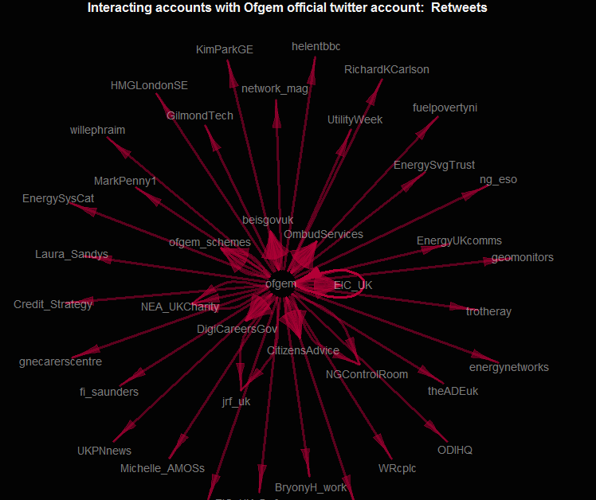
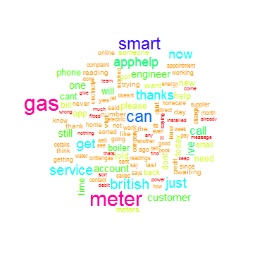
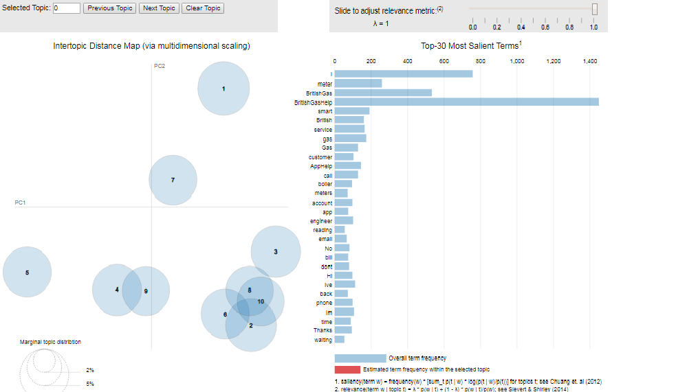
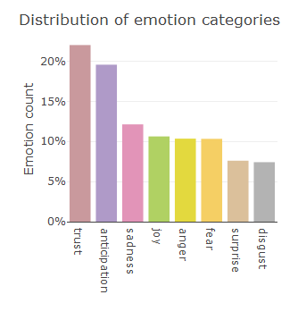
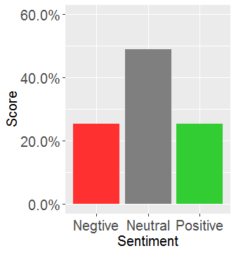
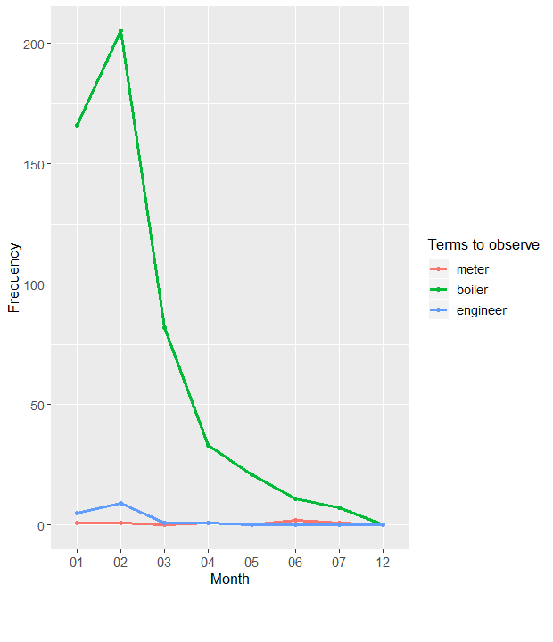
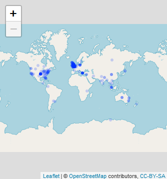

##  Getting started with R and R studio (Installation)
- First,we need to download R to our local computer from https://cran.r-project.org/ CRAN (Comprehensive R Archive Network). Download the package that applies to your computer and follow the prompts to install.

- Next we need to download and installR studio from https://www.rstudio.com/products/rstudio/download/. Select the free R studio Desktop open source lince and choose the package that applies to your computer.


##  Getting Twitter API keys
In order to access Twitter Search or Streaming API, we need to get four pieces of information from Twitter: API key, API secret, Access token and Access token secret.  You can obtain this information by following the steps below:

-	Create a Twitter account if you do not already have one.
- Go to https://apps.twitter.com/ and log in with your Twitter credentials.
- Click "Create New App" ( Note: If do you do not already have an existing app since July 2018, you will be asked to apply. Simply click the apply button.)
-	Fill out the form, agree to the terms, and click "Create your Twitter application"
-	In the next page, click on "API keys" tab, and copy your "API key" and "API secret".
-	Scroll down and click "Create my access token", and copy your "Access token" and "Access token secret"

## 1. Extracting tweets with specific hashtags or keywords

Once you have obtained the four authentication keys from Twitter, you can begin to search for specific keywords or hashtags of interest. In the code snippet below, we have extracted 200 tweets with the keyword "upwork". These parameters can be adjusted as necessary.

```{r, eval=FALSE}

# install relevant packages
install.packages("knitr",repos = "http://cran.us.r-project.org")
install.packages("twitteR")
install.packages("ROAuth")
library(twitteR)
library(ROAuth)

# authenticate with Twitter

consumerKey<-	"xxxxxxxxxxxxx"
consumerSecret<-"xxxxxxxxxxxxxx"

accessToken<-"xxxxxxxxx"
accessSecret<-"xxxxxxxxxxxx"

setup_twitter_oauth (consumerKey, consumerSecret, accessToken, accessSecret)  # authenticate

# search for tweets by keyword

tweets<-searchTwitter("upwork", n=200, lang=NULL, since=NULL, until=NULL, locale=NULL, geocode=NULL, sinceID=NULL, maxID=NULL,
                                resultType=NULL, retryOnRateLimit=120)

# put tweets in a data frame
tweets<-twListToDF(tweets)

# write out to a CSV file
write.csv(tweets, file="filename.csv")

```


## 2. Retrieval of timelines

You can retrieve a user's timeline (up to a maximum of 3200 tweets). Install rtweet and provide the authentication keys from Twitter. Use the get_timeline(s) functions to retrieve tweets that have been posted by a user. Specify the number of tweets you want to extract, then save the output to your desired format.

```{r, eval=FALSE}

# install rtweet if not yet installed
install.packages("rtweet")
library(rtweet)

# insert the consumer key and consumer secret from twitter
create_token(
  consumer_key = "xxxxxxx",
  consumer_secret = "xxxxxxxxxx"
)

# replace with the target user screen name or ID
timeline<-get_timeline("OfficialUoM",n=200)  

# do the following to get multiple users' timelines instead
timelines<-get_timelines(c("OfficialUoM","skynews"), n=200)

write.csv(timeline, file="timeline.csv")
```

## 3. Retrieving the followers of a specific user

To retrieve a list of IDs following a specific user, use the code below.

```{r, eval=FALSE}

# install rtweet if not yet installed
install.packages("rtweet")
library(rtweet)

# insert the consumer key and consumer secret from twitter
create_token(
  consumer_key = "xxxxxxxx",
  consumer_secret = "xxxxxxxx"
)

# get a list IDs of followers; replace with target user screen name
followers<- get_followers("skynews", n = 5000, page = "-1", retryonratelimit = FALSE,
              parse = TRUE, verbose = TRUE, token = NULL) 

# count number of followers
count<-nrow(followers)

write.csv(followers, file="followers.csv")

```


## 4. Retrieving a list of accounts (with associated metadata) followed by a user

To retrieve a list of IDs of accounts followed by a user use the code below. In addition, using the user ID, you can retrieve metadata associated with these accounts such as name, location, language, etc. The result will be a data frame with 88 metadata fields.

```{r, eval=FALSE}

#install rtweet if not yet installed
install.packages("rtweet")
library(rtweet)

# insert the consumer key and consumer secret from twitter
create_token(
  consumer_key = "xxxxxxxxxx",
  consumer_secret = "xxxxxxxxxxxxx"
)

# get list of accounts followed by a given account; replace with user screen name of interest
UoM_fds <- get_friends("OfficialUoM")

# save result as a CSV file
write.csv(UoM_fds, file="uomfds.csv") 

# retrieve metadata for these accounts: name, location, language, etc.
UoM_fds_data <- lookup_users(UoM_fds$user_id)
write.csv(UoM_fds_data, file="uomfds_metadata.csv") 

```

## 5.  Visualising a user's retweet network

This code will extract retweets from a user's timeline and display them as a network.

```{r, eval=FALSE}

library(twitteR)
library(ROAuth)
library(igraph)
library(stringr)
  
consumerKey <-	xxxxxxx
consumerSecret<- xxxxxxxxx
accessToken<- xxxxxx
accessSecret<- xxxxxxxx

# authenticate
setup_twitter_oauth (consumerKey, consumerSecret, accessToken, accessSecret)  

# replace with the target user screen name or ID
dm_tweets = userTimeline("Ofgem", n=700, includeRts = TRUE) 
  
# get text
dm_txt = sapply(dm_tweets, function(x) x$getText())

# regular expressions to find retweets
grep("(RT|via)((?:\\b\\W*@\\w+)+)", dm_tweets, ignore.case=TRUE, value=TRUE)
  
# determine which tweets are retweets
rt_patterns = grep("(RT|via)((?:\\b\\W*@\\w+)+)", dm_txt, ignore.case=TRUE)
  
# show retweets (these are the ones we want to focus on)
dm_txt[rt_patterns] 

# create list to store user names
who_retweet = as.list(1:length(rt_patterns))
who_post = as.list(1:length(rt_patterns))
  
for (i in 1:length(rt_patterns))
{ 
  # get tweet with retweet entity
  twit = dm_tweets[[rt_patterns[i]]]
  
  # get retweet source 
  poster = str_extract_all(twit$getText(), "(RT|via)((?:\\b\\W*@\\w+)+)") 
  
  # remove ':'
  poster = gsub(":", "", unlist(poster)) 
  
  # name of retweeted user
  who_post[[i]] = gsub("(RT @|via @)", "", poster, ignore.case=TRUE) 
  
  # name of retweeting user 
  who_retweet[[i]] = rep(twit$getScreenName(), length(poster)) 
}
  
# unlist
who_post = unlist(who_post)
who_retweet = unlist(who_retweet)
  
# create graph from an edge list
# results in two column matrix of edges
retweeter_poster = cbind(who_retweet, who_post)
  
# generate the graph
rt_graph = graph.edgelist(retweeter_poster)
  
# get vertex names
ver_labs = get.vertex.attribute(rt_graph, "name", index=V(rt_graph))

# choose a layout
glay = layout.fruchterman.reingold(rt_graph)
  
# plot
par(bg="gray1", mar=c(1,1,1,1))
result <- plot(rt_graph, layout=glay,
                vertex.color="gray25",
                vertex.size=10,
                vertex.label=ver_labs,
                vertex.label.family="sans",
                vertex.shape="none",
                vertex.label.color=hsv(h=0, s=0, v=.95, alpha=0.5),
                vertex.label.cex=0.85,
                edge.arrow.size=0.8,
                edge.arrow.width=0.5,
                edge.width=3,
                edge.color=hsv(h=.95, s=1, v=.7, alpha=0.5))

# add title
title("Interacting accounts with Ofgem official twitter account: Retweets",
        cex.main=1, col.main="gray95")
  
```
  
```{r echo=FALSE, out.width="50%", fig.cap="retweet network for Ofgem",fig.align= "center",message=FALSE, warning=FALSE}

# for knitting the document and enabling the include_graphics function
library(knitr)    
library(png)

# for grabbing the dimensions of png files

```
## 6. Data cleaning

The code below outlines the general steps taken to clean a set of tweets. Additional lines may be required depending on the desired output. Other forms of textual data sets may require additional steps/forms of cleaning. For this specific code, do ensure that you import a CSV file and that the column containing the text that you want to clean is named "Text".


```{r, eval=FALSE}
# install these packages if you do not have them installed yet
install.packages("twitteR")
install.packages("plyr")
install.packages("stringr")
install.packages(tm)

# load the libraries
library(twitteR)
library(plyr)
library(stringr)
library(ggplot2)
library(tm)

# import your data set to analyse,
# ensure it is in the same directory as your code, otherwise you need to add the path
Dataset2 <- read.csv(dataset)
tweets.df <- Dataset2$Text

# convert text to lowercase
tweets.df<-tolower(tweets.df)

# get rid of problem characters
tweets.df <- sapply(tweets.df,function(row) iconv(row, "latin1", "ASCII", sub=""))

# remove punctuation, digits, special characters etc
tweets.df = gsub("&amp", "", tweets.df)
tweets.df= gsub("(RT|via)((?:\\b\\W*@\\w+)+)", "", tweets.df)
tweets.df = gsub("@\\w+", "", tweets.df)
tweets.df= gsub("[[:punct:]]", "", tweets.df)
tweets.df = gsub("[[:digit:]]", "", tweets.df)
tweets.df = gsub("http\\w+", "", tweets.df)
tweets.df = gsub("[ \t]{2,}", "", tweets.df)
tweets.df= gsub("^\\s+|\\s+$", "", tweets.df) 


# get rid of unnecessary spaces
tweets.df <- str_replace_all(tweets.df," "," ")

# get rid of URLs
#tweets.df <- str_replace_all(tweets.df, "http://t.co/[a-z,A-Z,0-9]*{8}","")

# take out the retweet header (there is only one)
tweets.df <- str_replace(tweets.df,"RT @[a-z,A-Z]*: ","")

# get rid of hashtags
tweets.df <- str_replace_all(tweets.df,"#[a-z,A-Z]*","")

# get rid of references to other screen names
tweets.df <- str_replace_all(tweets.df,"@[a-z,A-Z]*","")  

View(tweets.df)

```


## 7.  Generating a word cloud

This code will perform cleaning over a set of tweets and generate a word cloud. It requires a CSV file where the column containing the text is named "Text". 

```{r, eval=FALSE}

# load the libraries
library(plyr)
library(stringr)
library(tm)
library(wordcloud)

#library(wordcloud2)

# get the text column
tweets.df<- dataset$Text
tweets.df <- sapply(tweets.df,function(row) iconv(row, "latin1", "ASCII", sub=""))

tweets.df = gsub("&amp", "", tweets.df)
tweets.df = gsub("(RT|via)((?:\\b\\W*@\\w+)+)", "", tweets.df)
tweets.df = gsub("@\\w+", "", tweets.df)
tweets.df = gsub("[[:punct:]]", "", tweets.df)
tweets.df = gsub("[[:digit:]]", "", tweets.df)
tweets.df = gsub("http\\w+", "", tweets.df)
tweets.df = gsub("[ \t]{2,}", "", tweets.df)
tweets.df = gsub("^\\s+|\\s+$", "", tweets.df) 

# corpus will hold a collection of text documents
tweet_corpus <- Corpus(VectorSource(tweets.df)) 
tweet_corpus
inspect(tweet_corpus[1])

# clean text
tweet_clean <- tm_map(tweet_corpus, removePunctuation)
tweet_clean <- tm_map(tweet_clean, removeWords, stopwords("english"))
tweet_clean <- tm_map(tweet_clean, removeNumbers)
tweet_clean <- tm_map(tweet_clean, stripWhitespace)
wordcloud(tweet_clean, random.order=0.5,max.words=100, col=rainbow(50),min.freq = 5,  scale=c(2.0,0.3))
```


```{r echo=FALSE, out.width="50%",fig.align= "center", fig.cap="Word Cloud of a text corpus", message=FALSE, warning=FALSE}

# for knitting the document and enabling the include_graphics function
library(knitr)    
library(png)

# for determining the dimensions of PNG files

```

## 8. Generating a topic model

The code below outlines the general steps taken to clean a set of tweets. Additional lines may be required depending on the desired output. Other forms of textual data sets may require additional steps/forms of cleaning. For this specific code, do ensure that you import a CSV file and that the column containing the text that you want to clean is named "Text".


```{r, eval= FALSE, message=FALSE}
#install.packages("LDAvis")
#install.packages("tm")
#install.packages("lda")
#install.packages("servr")
#install.packages("shiny")
#install.packages("stringr")

library(LDAvis)
library(tm)
library(lda)
library(shiny)
library(stringr)

stop_words <- stopwords("SMART")

Dataset2<-read.csv("dataset.csv")
tweet <- Dataset2$Text


tweet <- sapply(tweet, function(x) iconv(x, to='UTF-8', sub='byte'))


tweet= gsub("[[:punct:]]", "", tweet)
tweet = gsub("[[:digit:]]", "", tweet)
tweet= gsub("http\\w+", "", tweet)
tweet = gsub("[ \t]{2,}", "", tweet)
tweet= gsub("^\\s+|\\s+$", "", tweet) 
#ref: ( Hicks , 2014) 

#get rid of unnecessary spaces
tweet <- str_replace_all(tweet," "," ")

tweet <- str_replace(tweet,"RT @[a-z,A-Z]*: ","")
# Get rid of hashtags
tweet <- str_replace_all(tweet,"#[a-z,A-Z]*","")
# Get rid of references to other screennames
tweet<- str_replace_all(tweet,"@[a-z,A-Z]*","")  

# tokenize on space and output as a list:
doc.list <- strsplit(tweet, "[[:space:]]+")

# compute the table of terms:
term.table <- table(unlist(doc.list))
term.table <- sort(term.table, decreasing = TRUE)

# remove terms that are stop words or occur fewer than 5 times:
del <- names(term.table) %in% stop_words | term.table < 5
term.table <- term.table[!del]
vocab <- names(term.table)

# now put the documents into the format required by the lda package:
get.terms <- function(x) {
  index <- match(x, vocab)
  index <- index[!is.na(index)]
  rbind(as.integer(index - 1), as.integer(rep(1, length(index))))
}
documents <- lapply(doc.list, get.terms)

# Compute some statistics related to the data set:
D <- length(documents)  # number of documents 
W <- length(vocab)  # number of terms in the vocab 
doc.length <- sapply(documents, function(x) sum(x[2, ]))  # number of tokens per document 
N <- sum(doc.length)  # total number of tokens in the data 
term.frequency <- as.integer(term.table)  # frequencies of terms in the corpus 


# MCMC and model tuning parameters:
K <- 20
G <- 5000
alpha <- 0.02
eta <- 0.02

# Fit the model:
library(lda)
set.seed(357)
t1 <- Sys.time()
fit <- lda.collapsed.gibbs.sampler(documents = documents, K = 10, vocab = vocab, 
                                   num.iterations = 200, alpha = 0.5, eta=0.5,
                                    initial = NULL, burnin = 0,
                                   compute.log.likelihood = TRUE)
t2 <- Sys.time()
t2 - t1  

#LDAvis
theta <- t(apply(fit$document_sums + 0.5, 2, function(x) x/sum(x)))
phi <- t(apply(t(fit$topics) + 0.5, 2, function(x) x/sum(x)))


tweetvis <- list(phi = phi,
                     theta = theta,
                     doc.length = doc.length,
                     vocab = vocab,
                     term.frequency = term.frequency)


# create the JSON object to feed the visualization:
json <- createJSON(phi = tweetvis$phi, 
                   theta = tweetvis$theta, 
                   doc.length = tweetvis$doc.length, 
                   vocab = tweetvis$vocab, 
                   term.frequency = tweetvis$term.frequency)
serVis(json, out.dir = tempfile(), open.browser = interactive())

```
The result is an interactive webpage where you can view the different topics and select the number of of terms to include in a topic. You can read up more info on LDA visualization in this paper (sievert, 2014) https://nlp.stanford.edu/events/illvi2014/papers/sievert-illvi2014.pdf

```{r echo=FALSE, out.width="100%",out.height="50%", message=FALSE, warning=FALSE}
library(knitr)    # For knitting document and include_graphics function
library(png)   
# For grabbing the dimensions of png files

```


## 9. Emotion detection
This code below uses the NRC emotion lexicon to detect emotions in a text. For this code, we have removed the negative and positive (sentiment polarity) detection and only show eight emotions (trust, anticipation, sadness, joy, anger, fear, surprise and disgust). This code assumes that the column name for the text to be analyses is called "text".

```{r, eval= FALSE, message=FALSE}
library(syuzhet)
library(plotly)
library(tm)
library(wordcloud)

#import your dataset to analyse, 
#ensure it is in the same directory as your code, 
#otherwise you need to add the path
  
tweets <- read.csv(dataset.csv)
  clean_tweets = tweets$text
  
  #clean_tweets = sapply(tweets, function(x) x$getText())
  # remove retweet entities
  clean_tweets = gsub('(RT|via)((?:\\b\\W*@\\w+)+)', '', clean_tweets)
  # remove at people
  clean_tweets = gsub('@\\w+', '', clean_tweets)
  # remove punctuation
  clean_tweets = gsub('[[:punct:]]', '', clean_tweets)
  # remove numbers
  clean_tweets = gsub('[[:digit:]]', '', clean_tweets)
  # remove html links
  clean_tweets = gsub('http\\w+', '', clean_tweets)
  # remove unnecessary spaces
  clean_tweets = gsub('[ \t]{2,}', '', clean_tweets)
  clean_tweets = gsub('^\\s+|\\s+$', '', clean_tweets)
  # remove emojis or special characters
  clean_tweets = gsub('<.*>', '', enc2native(clean_tweets))
  
  clean_tweets = tolower(clean_tweets)
  
  #clean_tweets
  

  
  emotions <- get_nrc_sentiment(clean_tweets)
  emo_bar = colSums(emotions)
  emo_sum = data.frame(count=emo_bar, emotion=names(emo_bar))
  emo_sum$emotion = factor(emo_sum$emotion, levels=emo_sum$emotion[order(emo_sum$count, decreasing = TRUE)])
  
  emo_sum <- emo_sum[1:8,]
  emo_sum$percent<-(emo_sum$count/sum(emo_sum$count))*100
  
   #Visualize the emotions from NRC sentiments
plot_ly(emo_sum, x=~emotion, y=~percent, type="bar", color=~emotion) %>%
layout(xaxis=list(title=""),  yaxis = list(title = "Emotion count"),
showlegend=FALSE,title="Distribution of emotion categories") %>%
layout(yaxis = list(ticksuffix = "%"))
``` 
  

```{r echo=FALSE,out.width="50%",fig.align= "center", fig.cap= " Emotion categories for a text corpus", message=FALSE, warning=FALSE}
library(knitr)    # For knitting document and include_graphics function
library(png)   
# For grabbing the dimensions of png files

```

## 10.Detecting Sentiment Polarity
This code uses an external sentiment lexicon to detect the polarity of a text corpora. It classifies the sentiment of a piece of text as either positive, negative or neutral using the positive and negative sentiment lexicons. Do ensure that the positive and negative lexicon are in the same directory as the code.


```{r, eval= FALSE, message=FALSE}
#install.packages("twitteR")
#install.packages("plyr")
#install.packages("stringr")
#install.packages("tm")
#install.packages("scales")


#loading the library
library(plyr)
library(stringr)
library(ggplot2)
library(tm)
library(scales)


#read in the file
file<-read.csv(Dataset2.csv)
tweets.df<-file$Text
tweets.df<-tolower(tweets.df)


tweets.df <- sapply(tweets.df,function(row) iconv(row, "latin1", "ASCII", sub=""))

#cleaning the tweets
tweets.df = gsub("&amp", "", tweets.df)
tweets.df= gsub("(RT|via)((?:\\b\\W*@\\w+)+)", "", tweets.df)
tweets.df = gsub("@\\w+", "", tweets.df)
tweets.df= gsub("[[:punct:]]", "", tweets.df)
tweets.df = gsub("[[:digit:]]", "", tweets.df)
tweets.df = gsub("http\\w+", "", tweets.df)
tweets.df = gsub("[ \t]{2,}", "", tweets.df)
tweets.df= gsub("^\\s+|\\s+$", "", tweets.df) 


#get rid of unnecessary spaces
tweets.df <- str_replace_all(tweets.df," "," ")
# Get rid of URLs
#tweets.df <- str_replace_all(tweets.df, "http://t.co/[a-z,A-Z,0-9]*{8}","")
# Take out retweet header, there is only one
tweets.df <- str_replace(tweets.df,"RT @[a-z,A-Z]*: ","")
# Get rid of hashtags
tweets.df <- str_replace_all(tweets.df,"#[a-z,A-Z]*","")
# Get rid of references to other screennames
tweets.df <- str_replace_all(tweets.df,"@[a-z,A-Z]*","")  

#view cleaned tweets
View(tweets.df)


#Reading the Lexicon positive and negative words
pos <- readLines("positive_words.txt")
neg <- readLines("negative_words.txt")

#function to calculate sentiment score
score.sentiment <- function(sentences, pos.words, neg.words, .progress='none')
{
  # Parameters
  # sentences: vector of text to score
  # pos.words: vector of words of postive sentiment
  # neg.words: vector of words of negative sentiment
  # .progress: passed to laply() to control of progress bar
  
  # create simple array of scores with laply
  scores <- laply(sentences,
                  function(sentence, pos.words, neg.words)
                  {
                    # remove punctuation
                    sentence <- gsub("[[:punct:]]", "", sentence)
                    # remove control characters
                    sentence <- gsub("[[:cntrl:]]", "", sentence)
                    # remove digits
                    sentence <- gsub('\\d+', '', sentence)
                    
                    #convert to lower
                    sentence <- tolower(sentence)
                    
                    
                    # split sentence into words with str_split (stringr package)
                    word.list <- str_split(sentence, "\\s+")
                    words <- unlist(word.list)
                    
                    # compare words to the dictionaries of positive & negative terms
                    pos.matches <- match(words, pos)
                    neg.matches <- match(words, neg)
                    
                    # get the position of the matched term or NA
                    # we just want a TRUE/FALSE
                    pos.matches <- !is.na(pos.matches)
                    neg.matches <- !is.na(neg.matches)
                    
                    # final score
                    score <- sum(pos.matches) - sum(neg.matches)
                    return(score)
                  }, pos.words, neg.words, .progress=.progress )
  # data frame with scores for each sentence
  scores.df <- data.frame(text=sentences, score=scores)
  return(scores.df)
}
#sentiment score
scores_twitter <- score.sentiment(tweets.df, pos.txt, neg.txt, .progress='text')


View(scores_twitter)

#Summary of the sentiment scores
summary(scores_twitter)

scores_twitter$score_chr <- ifelse(scores_twitter$score < 0,'Negtive', ifelse(scores_twitter$score > 0, 'Positive', 'Neutral'))


View(scores_twitter)


#Convert score_chr to factor for visualizations
scores_twitter$score_chr <- as.factor(scores_twitter$score_chr)
names(scores_twitter)[3]<-paste("Sentiment")  

#plot to show number of negative, positive and neutral comments
Viz1 <- ggplot(scores_twitter, aes(x=Sentiment, fill=Sentiment))+ geom_bar(aes(y = (..count..)/sum(..count..))) + 
  scale_y_continuous(labels = percent)+labs(y="Score")+
  theme(text =element_text(size=15))+theme(axis.text = element_text(size=15))+ theme(legend.position="none")+ coord_cartesian(ylim=c(0,0.6)) + scale_fill_manual(values=c("firebrick1", "grey50", "limeGREEN"))
Viz1

```


```{r echo=FALSE,out.width="50%",fig.align="center", fig.cap= "Sentiment Polarity of a text corpus", message=FALSE, warning=FALSE}
library(knitr)    # For knitting document and include_graphics function
library(png)   
# For grabbing the dimensions of png files

```

## 11. Word Frequency Time Series
The code below measures the frequency of certain terms over time (Months of the year). The data used here is from twitter so this code in its form will only work for a data having a similar date format (usually twitter date format with column name created_at).


```{r, eval= FALSE, message=FALSE}
library(slam)
library(tm)
library(lubridate)
library(syuzhet)
library(dplyr)
library("reshape2")
library("ggplot2")


#read in the data
textdata <- read.csv(dataset3, encoding = "UTF-8")

#convert the twitter data format
textdata$created <- as.POSIXct(textdata$created_at, format="%a %b %d %H:%M:%S +0000 %Y", tz="GMT")
#select the months and keep as a date format
textdata$Month <- format(as.Date(textdata$created), "%m")
textdata$Month2 <- months(textdata$created)

names(textdata)[names(textdata) == 'Text'] <- 'text'#incase you data has the column name #Text, change it to "text" as the next line will only accept the column name "text"
#take the text column and convert to a corpus
textdata$doc_id<-textdata$doc_id <- seq_len(nrow(textdata))  # include the doc_id
#text<as.character(textdata$text)
corpus <- Corpus(DataframeSource(textdata))
corpus <- Corpus(DataframeSource(textdata))
corpus <- tm_map(corpus, content_transformer(tolower))
corpus <- tm_map(corpus, removeWords, stopwords("en"))
corpus <- tm_map(corpus, removePunctuation, preserve_intra_word_dashes = TRUE)
corpus <- tm_map(corpus, removeNumbers)
corpus <- tm_map(corpus, stripWhitespace)

#form a document term matrix
DTM <- DocumentTermMatrix(corpus)


#select the terms you want to observe
terms_to_observe <- c( "meter", "boiler", "engineer")
#reduce the DTM to contain only those terms
DTM_reduced <- as.matrix(DTM[, terms_to_observe])
#sum the frequecies 
counts_per_month<- aggregate(DTM_reduced, by = list(decade = textdata$Month), sum)


counts_per_month_long <- melt(counts_per_month, id="decade")  # convert to long format

#Visualize the word frequecy time series
p2 <- ggplot(data = counts_per_month_long, aes(x = factor(decade), y = value, colour = variable)) +       
    geom_line(aes(group = variable)) + geom_point() + xlab("Month") +
  ylab("Frequency") +  labs(color='Terms to observe') 

p2

```

```{r echo=FALSE,out.width="70%",fig.align="center", fig.cap= "Word Frequency Time Series",message=FALSE, warning=FALSE}
library(knitr)    # For knitting document and include_graphics function
library(png)   
# For grabbing the dimensions of png files


```


## 12. Maping twitter users (key word)
This code extracts and visualizes the geocode of tweets relating to a specific keyword search. It requires users to obtain a Google geocoding API key. This can be obtained as follows:

- Go to the Google Cloud Platform Console.
- From the Project drop-down menu, select or create the project for which you want to add an API key.
- From the  Navigation menu, select APIs & Services > Credentials.
On the Credentials page, click Create credentials > API key. 
The API key created dialog displays your newly created API key. Copy this key as insert it in the relevant place in your R code
- On the dialog, click Restrict Key. 
(For more information, see Restricting an API key.)
On the API key page, under Key restrictions, set the Application restrictions.

The code below is built on: http://lucaspuente.github.io/notes/2016/04/05/Mapping-Twitter-Followers.

AS  expected note that most of the tweets about brexit are coming from the United kingdom and the United States of America.
```{r, eval= FALSE, message=FALSE}
#######
#Step 1: Enable pings to the Twitter API:
#######
#Load / install "twitteR" package:
if (!require("twitteR")) {
  install.packages("twitteR", repos="http://cran.rstudio.com/") 
  library("twitteR")
}
consumerKey <-"xxxxxx"
consumerSecret<-"xxxxxxx"

accessToken<-"xxxxxx"
accessSecret<-"xxxx"
#Log your info with the Twitter API:
options(httr_oauth_cache=T) #This will enable the use of a local file to cache OAuth access credentials between R sessions.
setup_twitter_oauth(consumerKey,
                    consumerSecret,
                    accessToken,
                    accessSecret)
#######
# Step 2: Download the Followers of a Given Twitter Account
library(rtweet)
search<-search_tweets("brexit", n=200)
#######


if (!require("data.table")) {
  install.packages("data.table", repos="http://cran.rstudio.com/") 
  library("data.table")
}
#Turn this data into a data frame:
search<-subset(search, location!="")
#######
# Step 4: Geocode Followers' Locations
#######
#Remove special characters:
search$location<-gsub("%", " ",search$location)
#Install key package helpers:
source("https://raw.githubusercontent.com/LucasPuente/geocoding/master/geocode_helpers.R")
#Install modified version of the geocode function
#(that now includes the api_key parameter):
source("https://raw.githubusercontent.com/LucasPuente/geocoding/master/modified_geocode.R")
#Generate specific geocode function:
geocode_apply<-function(x){
  geocode(x, source = "google", output = "all", api_key="insert google geocoding api key")
}
#Apply this new function to entire list:
geocode_results<-sapply(search$location, geocode_apply, simplify = F)
#Look at the number of geocoded locations:
length(geocode_results)
#######
#Step 5: Clean Geocoding Results
#######
#Only keep locations with "status" = "ok"
condition_a <- sapply(geocode_results, function(x) x["status"]=="OK")
geocode_results<-geocode_results[condition_a]
#Only keep locations with one match:
condition_b <- lapply(geocode_results, lapply, length)
condition_b2<-sapply(condition_b, function(x) x["results"]=="1")
geocode_results<-geocode_results[condition_b2]
#Look at the number of *successfully* geocoded locations:
length(geocode_results)
#Address formatting issues:
source("https://raw.githubusercontent.com/LucasPuente/geocoding/master/cleaning_geocoded_results.R")
#Turn list into a data.frame:
results_b<-lapply(geocode_results, as.data.frame)
results_c<-lapply(results_b,function(x) subset(x, select=c("results.formatted_address", "results.geometry.location")))
#Format thes new data frames:
results_d<-lapply(results_c,function(x) data.frame(Location=x[1,"results.formatted_address"],
                                                   lat=x[1,"results.geometry.location"],
                                                   lng=x[2,"results.geometry.location"]))
#Bind these data frames together:
results_e<-rbindlist(results_d)
#Add info on the original (i.e. user-provided) locatio/'-n string:
results_f<-results_e[,Original_Location:=names(results_d)]
#Only keep American results:
library(leaflet)
site_locations <- leaflet(results_f) %>%
  addTiles() %>%
  addCircleMarkers(lng = ~lng, lat = ~lat, popup = ~results_f,
                   radius = 3, stroke = FALSE)

site_locations

##
```


```{r echo=FALSE, fig.align="center",fig.cap="Geo-map of 200 tweets about Brexit",out.width="50%", message=FALSE, warning=FALSE}
library(knitr)    # For knitting document and include_graphics function
library(png)   
# For grabbing the dimensions of png files


#\captionof{figure}{caption}

```

