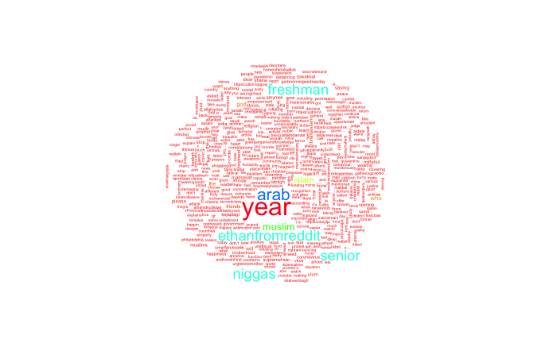

```{r setup, include=FALSE}
knitr::opts_chunk$set(echo = TRUE)
```

## R Markdown
## 1. Authentication with Twitter
The first step is to use Direct Authentication with Twitter using the given Consumer Key, Consumer Secret, Access Token, and Access Secret.
```{r, eval=FALSE}
library(twitteR)
library(ROAuth)

# authenticate with Twitter

# DON'T UPLOAD THE KEYS ON GITHUB, AS THIS IS PUBLIC REPO
consumerKey<-	"XXX"
consumerSecret<-"XXX"
accessToken<-"XXX"
accessSecret<-"XXX"


setup_twitter_oauth (consumerKey, consumerSecret, accessToken, accessSecret)  # authenticate
```


## 1. Extracting tweets with specific hashtags or keywords

This part of the R code extracts tweets based on specific hashtags or keywords. In the code snippet below, we will extract 2000 tweets with a specified keyword. These parameters can be adjusted as necessary.

```{r, eval=FALSE}
library(twitteR)
library(ROAuth)

# Parameter settings
n<-1000
lang<-"en"
since<-NULL #YYYY-MM-DD #in the past seven days only
until<-NULL  #YYYY-MM-DD #if more than that you will get error : tweets were requested but the API can only return 0
locale<-NULL
geocode<-NULL
sinceID<-NULL
maxID<-NULL
resultType<-"mixed"
retryOnRateLimit<-120

# search for tweets by keyword 'muslim'
keyword<-"muslim"
tweets<-searchTwitter(keyword, n, lang, since, until, locale, geocode, sinceID, maxID,
                                resultType, retryOnRateLimit)
# put tweets in a data frame
tweets_muslim<-twListToDF(tweets)

# search for tweets by keyword 'islam'
keyword<-"islam"
tweets<-searchTwitter(keyword, n, lang, since, until, locale, geocode, sinceID, maxID,
                                resultType, retryOnRateLimit)
# put tweets in a data frame
tweets_islam<-twListToDF(tweets)

# search for tweets by keyword 'arab'
keyword<-"arab"
tweets<-searchTwitter(keyword, n, lang, since, until, locale, geocode, sinceID, maxID,
                                resultType, retryOnRateLimit)
# put tweets in a data frame
tweets_arab<-twListToDF(tweets)

# search for tweets by keyword 'muhammad'
keyword<-"arab"
tweets<-searchTwitter(keyword, n, lang, since, until, locale, geocode, sinceID, maxID,
                                resultType, retryOnRateLimit)
# put tweets in a data frame
tweets_muhammad<-twListToDF(tweets)

# search for tweets by keyword
keyword<-"arab"
tweets<-searchTwitter(keyword, n, lang, since, until, locale, geocode, sinceID, maxID,
                                resultType, retryOnRateLimit)
# put tweets in a data frame
tweets_arab<-twListToDF(tweets)

#combine tweet dataframes
all_muslim_tweets <- rbind(tweets_muslim, tweets_islam, tweets_arab, tweets_muhammad)
# write out to a CSV file
write.csv(all_muslim_tweets, file="muslim_tweets.csv")
```
# 2. Data Cleaning
In this step we will clean the data obtained from Twitter. The general steps taken to clean a set of tweets are outlined. Additional lines may be required depending on the desired output. Other forms of textual data sets may require additional steps/forms of cleaning. For this specific code, do ensure that you import a CSV file and that the column containing the text that you want to clean is named "Text".

```{r, eval=FALSE}
# run this block to install these packages if you do not have them installed yet
#install.packages("plyr")
#install.packages("stringr")
#install.packages("tm")
install.packages("syuzhet")
install.packages("plotly")
install.packages("ggplot2")
```

```{r, eval= FALSE, message=FALSE}
# load the libraries
library(syuzhet)
library(plotly)
library(tm)
library(plyr)
library(stringr)
library(ggplot2)

#import your dataset to analyse, 
tweets <- read.csv("muslim_tweets.csv")
clean_tweets.df = tweets$text

# convert text to lowercase
clean_tweets.df<-tolower(clean_tweets.df)

# get rid of problem characters
clean_tweets.df <- sapply(clean_tweets.df,function(row) iconv(row, "latin1", "ASCII", sub=""))
  
clean_tweets.df = gsub("&amp", "", clean_tweets.df)
#remove retweet entities
clean_tweets.df = gsub('(RT|via)((?:\\b\\W*@\\w+)+)', '', clean_tweets.df)
# remove at people
clean_tweets.df = gsub('@\\w+', '', clean_tweets.df)
# remove punctuation
clean_tweets.df = gsub('[[:punct:]]', '', clean_tweets.df)
# remove numbers
clean_tweets.df = gsub('[[:digit:]]', '', clean_tweets.df)
# remove html links
clean_tweets.df = gsub('http\\w+', '', clean_tweets.df)
# remove unnecessary spaces
clean_tweets.df = gsub('[ \t]{2,}', '', clean_tweets.df)
clean_tweets.df = gsub('^\\s+|\\s+$', '', clean_tweets.df)
# remove emojis or special characters
clean_tweets.df = gsub('<.*>', '', enc2native(clean_tweets.df))

# get rid of unnecessary spaces
clean_tweets.df <- str_replace_all(clean_tweets.df," "," ")

# get rid of URLs - does not work
#clean_tweets.df <- str_replace_all(clean_tweets.df, "http://t.co/[a-z,A-Z,0-9]*{8}","")

# take out the retweet header (there is only one)
clean_tweets.df <- str_replace(clean_tweets.df,"RT @[a-z,A-Z]*: ","")

# get rid of hashtags
clean_tweets.df <- str_replace_all(clean_tweets.df,"#[a-z,A-Z]*","")

# get rid of references to other screen names
clean_tweets.df <- str_replace_all(clean_tweets.df,"@[a-z,A-Z]*","")  

#enable to view
#View(clean_tweets.df)

#store in csv
write.csv(clean_tweets.df, file="clean_muslim_tweets.csv")

```
## 3.  Generating a word cloud

This code will perform cleaning over a set of tweets and generate a word cloud. It requires a CSV file where the column containing the text is named "Text".
```{r, eval=FALSE}
# run this block to install these packages if you do not have them installed yet
install.packages("wordcloud")
```

```{r, eval=FALSE}

# load the libraries
library(plyr)
library(stringr)
library(tm)
library(wordcloud)

#import dataset and get the text column to analyse
tweets <- read.csv("muslim_tweets.csv")
clean_tweets.df = tweets$text

# corpus will hold a collection of text documents
tweet_corpus <- Corpus(VectorSource(clean_tweets.df)) 
tweet_corpus
inspect(tweet_corpus[1])

# clean text
tweet_clean <- tm_map(tweet_corpus, removePunctuation)
tweet_clean <- tm_map(tweet_clean, removeWords, stopwords("english"))
tweet_clean <- tm_map(tweet_clean, removeNumbers)
tweet_clean <- tm_map(tweet_clean, stripWhitespace)
wordcloud(tweet_clean, random.order=0.5,max.words=500, col=rainbow(50),min.freq = 10,  scale=c(2.0,0.3))

# wordcloud(christian_corpus,min.freq = 10,colors=brewer.pal(8, "Dark2"),random.color = TRUE,max.words = 500)
```
```{r echo=FALSE, out.width="50%",fig.align= "center", fig.cap="Word Cloud of a text corpus", message=FALSE, warning=FALSE}

# for knitting the document and enabling the include_graphics function
library(knitr)    
library(png)

# for determining the dimensions of PNG files

```
## 3.Detecting Sentiment Polarity
This code uses an external sentiment lexicon to detect the polarity of a text corpora. It classifies the sentiment of a piece of text as either positive, negative or neutral using the positive and negative sentiment lexicons. Do ensure that the positive and negative lexicon are in the same directory as the code.

```{r, eval=FALSE}
#install.packages("scales")
```


```{r, eval= FALSE, message=FALSE}
#loading the library
library(plyr)
library(stringr)
library(ggplot2)
library(tm)
library(scales)


#import dataset and get the text column to analyse
tweets <- read.csv("muslim_tweets.csv")
clean_tweets.df = tweets$text

#Reading the Lexicon positive and negative words
pos <- readLines("positive_words.txt")
neg <- readLines("negative_words.txt")

#function to calculate sentiment score
score.sentiment <- function(sentences, pos.words, neg.words, .progress='none')
{
  # Parameters
  # sentences: vector of text to score
  # pos.words: vector of words of postive sentiment
  # neg.words: vector of words of negative sentiment
  # .progress: passed to laply() to control of progress bar
  
  # create simple array of scores with laply
  scores <- laply(sentences,
                  function(sentence, pos.words, neg.words)
                  {
                    # remove punctuation
                    sentence <- gsub("[[:punct:]]", "", sentence)
                    # remove control characters
                    sentence <- gsub("[[:cntrl:]]", "", sentence)
                    # remove digits
                    sentence <- gsub('\\d+', '', sentence)
                    
                    #convert to lower
                    sentence <- tolower(sentence)
                    
                    
                    # split sentence into words with str_split (stringr package)
                    word.list <- str_split(sentence, "\\s+")
                    words <- unlist(word.list)
                    
                    # compare words to the dictionaries of positive & negative terms
                    pos.matches <- match(words, pos)
                    neg.matches <- match(words, neg)
                    
                    # get the position of the matched term or NA
                    # we just want a TRUE/FALSE
                    pos.matches <- !is.na(pos.matches)
                    neg.matches <- !is.na(neg.matches)
                    
                    # final score
                    score <- sum(pos.matches) - sum(neg.matches)
                    return(score)
                  }, pos.words, neg.words, .progress=.progress )
  # data frame with scores for each sentence
  scores.df <- data.frame(text=sentences, score=scores)
  return(scores.df)
}

#sentiment score
scores_twitter <- score.sentiment(clean_tweets.df, pos.txt, neg.txt, .progress='text')


#View(scores_twitter)

#Summary of the sentiment scores
summary(scores_twitter)

scores_twitter$score_chr <- ifelse(scores_twitter$score < 0,'Negative', ifelse(scores_twitter$score > 0, 'Positive', 'Neutral'))
View(clean_tweets.df)
View(scores_twitter)


#Convert score_chr to factor for visualizations
scores_twitter$score_chr <- as.factor(scores_twitter$score_chr)
names(scores_twitter)[3]<-paste("Sentiment")

#plot to show number of negative, positive and neutral comments
Viz1 <- ggplot(scores_twitter, aes(x=Sentiment, fill=Sentiment))+ geom_bar(aes(y = (..count..)/sum(..count..))) + 
  scale_y_continuous(labels = percent)+labs(y="Score")+
  theme(text =element_text(size=15))+theme(axis.text = element_text(size=15))+ theme(legend.position="none")+ coord_cartesian(ylim=c(0,0.6)) + scale_fill_manual(values=c("firebrick1", "grey50", "limeGREEN"))
Viz1

```
# Location Analysis

```{r, eval=FALSE}

#combine cleaned tweets with sentiment scores
tweets <- read.csv("muslim_tweets.csv")
clean_tweets.df = tweets$text$


#all_muslim_tweets <- rbind(tweets_muslim, tweets_islam, tweets_arab, tweets_muhammad)
```


